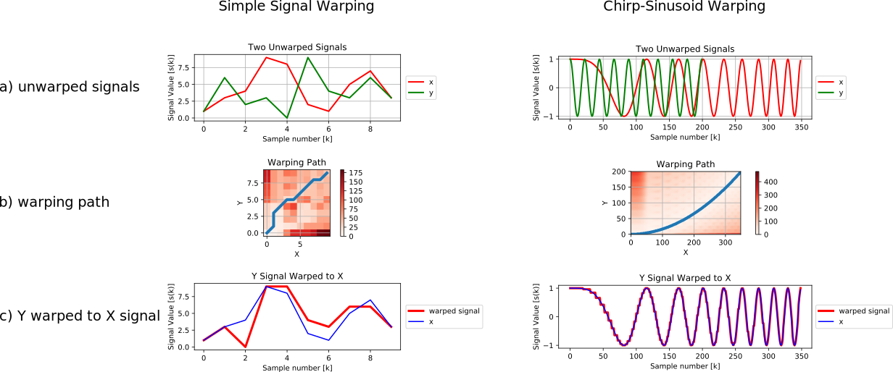

# Dynamic Time Warping (DTW)

This is a library I made to perform dynamic time warping (DTW) using Python.

## References

References to learn more about dynamic time warping:

* [Wikipedia](https://en.wikipedia.org/wiki/Dynamic_time_warping)
* [Programatically understanding dynamic time warping (DTW)](https://nipunbatra.github.io/blog/ml/2014/05/01/dtw.html)
